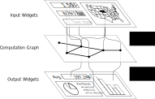

# ipywidgets-runner
### Supercharge your ipywidgets dashboards and apps in Jupyter

`Ipywidgets` is an excellent dashboarding tool for data visualization in Jupyter.
But in typical setups the whole dashboard gets recalculated with every change in the configuration: even if you're changing a small parameter in the dashboard (such as the date range), the entire data analysis script runs again, greatly slowing down data exploration.

`Ipywidgets-runner` alleviates this issue by providing a framework for attaching `ipywidgets` widgets to different stages in your data analysis.
Then, when a user changes a parameter, `ipywidgets-runner` intelligently re-executes those parts of your data analysis that actually need re-executing.

And what's better, if the dashboard has seen that parameter before, it pulls the output from a cache rather than recalculating anything.
So flip-flopping between two months in your timeseries analysis?
Instant.

## Using `ipywidgets-runner`

`ipywidgets-runner` was designed to be easily integrated into existing Jupyter notebooks.
You use it by specifying a directed acyclic graph, shown as the middle layer in this diagram:



## An Example

It's very easy to integrate `ipywidgets-runner` into your existing data analysis.

1. Data analysis typically takes the form of one big function _f_ which maps parameters to an collection of outputs, such as tables, charts, maps, or images.
The first step is to split this function _f_ into a collection of smaller, interdependent functions.

2. Express the interdependence of these functions by linking them up in ipywidgets-runner _nodes_.


```python
import ipywidgets as w
import ipywidgets_runner as wr

first_name_widget = w.Text()
last_name_widget = w.Text()
age_widget = w.Date()
output_widget = w.Output()

full_name_node = wr.Node(
  input=[first_name_widget, last_name_widget],
  f=lambda x, y: x+y
)
  
name_and_time_node = wr.Node(
  input=[full_name_node, age_widget],
  f=lambda x, y: x + str(datetime.now()-y)
)

output_node = wr.OutNode(
  input=[name_and_time_node],
  f=lambda x: plot(x),
  out=output_widget
)

container_widget = w.VBox([first_name_widget, last_name_widget, age_widget, output_widget])

wr.start(container_widget)
```

Complete:
 - [x] DAG-based runtime core
 - [x] Debug mode
 - [x] Worker threading

In progress:
 - [ ] Styling of widgets to show stale vs fresh outputs
 - [ ] Worker multiprocessing (optionally)
 - [ ] Config # of worker threads
 - [ ] Allow for better diffing than just "=="
 
Future Work and Design Considerations:
 - [ ] Automatically construct DAG via static analysis
 - [ ] Disk cache previous computations
 - [ ] Allow for subsetting: (e.g., if the new time range is a subinterval of the old one, maybe you don't need to hit the SQL data store again)
